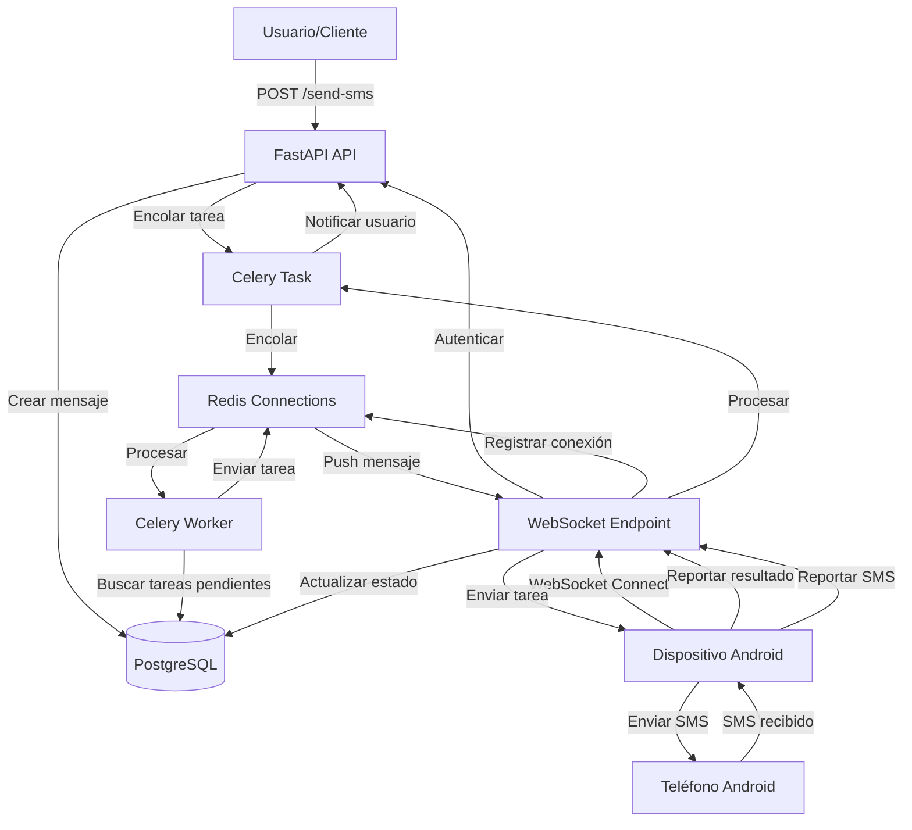

# Implementación de Gateway SMS con Celery y Conexión Android

## Arquitectura General

El sistema consistirá en:

- **API FastAPI**: Endpoints REST para usuarios y WebSocket para dispositivos Android
- **Celery Workers**: Procesamiento asíncrono de mensajes SMS
- **Redis**: Broker de mensajes para Celery y gestión de conexiones WebSocket
- **PostgreSQL**: Base de datos para dispositivos, mensajes y estados
- **Comunicación Android**: WebSocket bidireccional en tiempo real (sin Firebase, sin polling)

## Flujo de Datos Completo




## Componentes a Implementar

### 1. Configuración de Celery y Redis

**Archivos a crear/modificar:**

- `backend/app/core/celery_app.py` - Configuración de Celery
- `backend/app/core/config.py` - Agregar configuraciones de Celery y Redis
- `backend/pyproject.toml` - Agregar dependencias: `celery`, `redis`
- `docker-compose.yml` - Agregar servicio Redis y Celery worker

### 2. Modelos de Base de Datos

**Archivo:** `backend/app/models.py`Modelos necesarios:

- `SMSDevice`: Dispositivos Android (id, nombre, número_teléfono, api_key, estado, último_heartbeat, usuario_id, etc.)
- `SMSMessage`: Mensajes SMS (id, dispositivo_id, destinatario, remitente, contenido, estado, tipo, timestamps, webhook_sent, etc.)
- `WebhookConfig`: Configuración de webhooks por usuario (id, usuario_id, url, secret_key, eventos, activo, etc.)
- `UserPlan`: Planes de usuario (id, nombre, max_sms_per_month, max_devices, precio, etc.)
- `UserQuota`: Tracking de uso por usuario (id, usuario_id, plan_id, sms_sent_this_month, devices_registered, last_reset_date, etc.)
- Estados de mensajes: `pending`, `assigned`, `sending`, `sent`, `delivered`, `failed`
- Tipos de mensajes: `outgoing` (enviar), `incoming` (recibido)

### 3. Tareas de Celery

**Archivo:** `backend/app/tasks/sms_tasks.py`Tareas principales:

- `assign_pending_messages`: Asignar mensajes pendientes a dispositivos disponibles
- `send_message_to_device`: Enviar mensaje a dispositivo vía WebSocket (integración con WebSocketManager)
- `process_incoming_sms`: Procesar SMS entrantes reportados por Android
- `send_webhook_notification`: Enviar notificación HTTP a webhook configurado cuando llega SMS
- `update_message_status`: Actualizar estado de mensajes
- `retry_failed_messages`: Reintentar mensajes fallidos
- `retry_webhook_delivery`: Reintentar envío de webhooks fallidos
- `cleanup_offline_devices`: Marcar dispositivos offline si no hay conexión WebSocket activa
- `reset_monthly_quotas`: Resetear contadores mensuales de SMS (tarea periódica)
- `check_user_quota`: Verificar límites de usuario antes de operaciones

### 4. API REST para Usuarios (Panel Web y API Externa)

**Archivo:** `backend/app/api/routes/sms.py`Endpoints para usuarios autenticados (JWT):**Envío y gestión de SMS:**

- `POST /api/v1/sms/send` - Enviar SMS individual (crea mensaje pendiente)
- Body: `{"to": "+1234567890", "body": "Mensaje", "device_id": "uuid"}` (device_id opcional)
- Response: `{"message_id": "uuid", "status": "pending"}`
- Valida límites de SMS antes de crear mensaje
- `POST /api/v1/sms/send-bulk` - Enviar SMS a múltiples destinatarios (bulk)
- Body: `{"recipients": ["+1234567890", "+0987654321"], "body": "Mensaje", "device_id": "uuid"}` (device_id opcional)
- Response: `{"task_id": "uuid", "total_recipients": 2, "status": "processing", "message_ids": ["uuid1", "uuid2"]}`
- Valida límites de SMS antes de crear mensajes (total de destinatarios)
- Crea un mensaje por cada destinatario
- Procesa de forma asíncrona con Celery
- `GET /api/v1/sms/messages` - Listar mensajes del usuario (con paginación y filtros)
- `GET /api/v1/sms/messages/{message_id}` - Obtener mensaje específico
- `GET /api/v1/sms/incoming` - Listar SMS recibidos

**Gestión de planes y límites:**

- `GET /api/v1/sms/plans` - Listar planes disponibles
- `GET /api/v1/sms/quota` - Obtener información de cuota actual del usuario
- Response: `{"plan": "Free", "sms_sent_this_month": 50, "max_sms_per_month": 100, "devices_registered": 1, "max_devices": 2, "reset_date": "2024-02-01"}`
- `PUT /api/v1/sms/quota/upgrade` - Cambiar plan del usuario (requiere superuser o integración de pago)

**Gestión de dispositivos:**

- `POST /api/v1/sms/devices` - Registrar nuevo dispositivo (genera API key)
- Valida límite de dispositivos antes de registrar
- Response: `{"device_id": "uuid", "api_key": "xxx", "status": "registered"}`
- `GET /api/v1/sms/devices` - Listar dispositivos del usuario
- `GET /api/v1/sms/devices/{device_id}` - Obtener dispositivo específico
- `PUT /api/v1/sms/devices/{device_id}` - Actualizar dispositivo
- `DELETE /api/v1/sms/devices/{device_id}` - Eliminar dispositivo
- Decrementa contador de dispositivos registrados

**Gestión de webhooks:**

- `POST /api/v1/sms/webhooks` - Crear/configurar webhook para recepciones
- Body: `{"url": "https://example.com/webhook", "secret_key": "opcional", "events": ["sms_received"]}`
- `GET /api/v1/sms/webhooks` - Listar webhooks configurados
- `GET /api/v1/sms/webhooks/{webhook_id}` - Obtener webhook específico
- `PUT /api/v1/sms/webhooks/{webhook_id}` - Actualizar webhook
- `DELETE /api/v1/sms/webhooks/{webhook_id}` - Eliminar webhook
- `POST /api/v1/sms/webhooks/{webhook_id}/test` - Probar webhook con mensaje de prueba

### 5. WebSocket para Dispositivos Android

**Archivo:** `backend/app/api/routes/android.py`Endpoint WebSocket:

- `WS /api/v1/android/ws?api_key=xxx` - Conexión WebSocket persistente

**Archivo:** `backend/app/services/websocket_manager.py`Gestión de conexiones:

- `WebSocketManager`: Gestiona conexiones WebSocket activas por dispositivo
- `ConnectionManager`: Maneja múltiples conexiones y broadcasting
- Integración con Redis para escalabilidad (opcional)

Mensajes WebSocket (JSON):

- **Cliente → Servidor:**
- `{"type": "register", "device_name": "...", "phone_number": "..."}` - Registrar dispositivo
- `{"type": "sms_report", "message_id": "...", "status": "sent|failed", "error": "..."}` - Reportar SMS enviado
- `{"type": "sms_incoming", "from": "...", "body": "...", "timestamp": "..."}` - Reportar SMS recibido
- `{"type": "ping"}` - Heartbeat/keepalive
- **Servidor → Cliente:**
- `{"type": "task", "message_id": "...", "to": "...", "body": "..."}` - Nueva tarea de envío
- `{"type": "ack", "message_id": "..."}` - Confirmación de recepción
- `{"type": "error", "message": "..."}` - Error en la conexión
- `{"type": "pong"}` - Respuesta a ping

### 6. Autenticación de Dispositivos

**Archivo:** `backend/app/api/deps.py`Funciones de dependencia:

- `get_device_by_api_key`: Validar API key y obtener dispositivo
- `verify_device_active`: Verificar que el dispositivo esté activo y online

### 7. Servicios de SMS

**Archivo:** `backend/app/services/sms_service.py`Lógica de negocio:

- `SMSProvider`: Clase base abstracta para proveedores SMS
- `AndroidSMSProvider`: Proveedor que asigna mensajes a dispositivos Android
- `assign_message_to_device`: Asignar mensaje a dispositivo disponible
- `process_incoming_sms`: Procesar SMS entrantes desde Android
- `QuotaService`: Servicio para gestionar límites y planes
- `check_sms_quota(user_id, count)`: Verificar si usuario puede enviar N SMS
- `check_device_quota(user_id)`: Verificar si usuario puede registrar otro dispositivo
- `increment_sms_count(user_id, count)`: Incrementar contador de SMS enviados
- `increment_device_count(user_id)`: Incrementar contador de dispositivos
- `decrement_device_count(user_id)`: Decrementar contador de dispositivos
- `get_user_quota(user_id)`: Obtener información de cuota del usuario

### 8. Migraciones de Base de Datos

**Archivo:** `backend/app/alembic/versions/xxx_add_sms_models.py`Crear migración para:

- Tabla `smsdevice` (dispositivos Android)
- Tabla `smsmessage` (mensajes SMS)
- Tabla `webhookconfig` (configuración de webhooks)
- Tabla `userplan` (planes disponibles: Free, Basic, Pro, Enterprise)
- Tabla `userquota` (tracking de uso por usuario)
- Índices: dispositivo_id, estado, tipo, timestamps, usuario_id, webhook_sent, plan_id
- Relaciones: dispositivo -> mensajes, usuario -> dispositivos, usuario -> webhooks, usuario -> quota -> plan

### 9. Docker Compose

**Archivo:** `docker-compose.yml`Agregar servicios:

- `redis`: Broker para Celery (puerto 6379)
- `celery-worker`: Worker de Celery para procesar tareas
- `celery-beat`: Scheduler opcional para tareas periódicas (cleanup, retry)

## Estructura de Archivos

```javascript
backend/app/
├── core/
│   ├── celery_app.py          # Nueva: Configuración Celery
│   └── config.py              # Modificar: Agregar config Redis/Celery
├── models.py                  # Modificar: Agregar modelos SMS
├── tasks/
│   ├── __init__.py            # Nueva: Inicializar Celery app
│   └── sms_tasks.py           # Nueva: Tareas SMS
├── services/
│   ├── __init__.py            # Nueva
│   ├── sms_service.py         # Nueva: Lógica de negocio SMS
│   ├── websocket_manager.py   # Nueva: Gestión de conexiones WebSocket
│   ├── webhook_service.py     # Nueva: Lógica para enviar webhooks HTTP
│   └── quota_service.py       # Nueva: Gestión de límites y planes
├── api/
│   ├── deps.py                # Modificar: Agregar get_device_by_api_key
│   └── routes/
│       ├── sms.py             # Nueva: Endpoints REST para usuarios
│       └── android.py         # Nueva: WebSocket endpoint para dispositivos Android
└── crud.py                    # Modificar: Agregar CRUD para SMS
```


## Flujo de Comunicación Android via WebSocket

### Conexión WebSocket

1. App Android establece conexión WebSocket: `ws://api.dominio.com/api/v1/android/ws?api_key=xxx`
2. Servidor valida API key y registra la conexión
3. Conexión se mantiene abierta de forma persistente

### Registro de Dispositivo (vía WebSocket)

1. App Android envía mensaje JSON:
   ```json
               {"type": "register", "device_name": "Mi Android", "phone_number": "+1234567890"}
   ```


2. Servidor valida y actualiza dispositivo en BD
3. Servidor responde con confirmación

### Recepción de Tareas (Push en Tiempo Real)

1. Usuario envía SMS desde panel web
2. Celery worker asigna mensaje a dispositivo disponible
3. Servidor envía mensaje WebSocket al dispositivo:
   ```json
               {"type": "task", "message_id": "uuid", "to": "+1234567890", "body": "Mensaje texto"}
   ```


4. App Android recibe mensaje inmediatamente (sin polling)
5. App Android envía SMS usando Android SMS Manager
6. App Android reporta resultado:
   ```json
               {"type": "sms_report", "message_id": "uuid", "status": "sent"}
   ```


### SMS Entrantes

1. App Android detecta SMS recibido (BroadcastReceiver)
2. Envía a servidor vía WebSocket:
   ```json
               {"type": "sms_incoming", "from": "+1234567890", "body": "Texto", "timestamp": "2024-01-01T00:00:00Z"}
   ```


3. Servidor procesa SMS entrante:

- Guarda en BD con estado `received`
- Si usuario tiene webhook configurado, Celery envía notificación HTTP
- Webhook recibe: `{"event": "sms_received", "from": "+1234567890", "body": "Texto", "timestamp": "...", "message_id": "uuid"}`

### Heartbeat/Keepalive

1. App Android envía ping cada 60 segundos: `{"type": "ping"}`
2. Servidor responde: `{"type": "pong"}`
3. Si no hay ping en 5 minutos, servidor cierra conexión y marca dispositivo offline

## Sistema de Planes y Límites

### Planes Predefinidos

El sistema incluye 4 planes predefinidos que se crean automáticamente en la base de datos:

1. **Free** (Plan por defecto):

- `max_sms_per_month`: 50
- `max_devices`: 1
- `price`: 0.00

2. **Basic**:

- `max_sms_per_month`: 500
- `max_devices`: 3
- `price`: 9.99 (ejemplo)

3. **Pro**:

- `max_sms_per_month`: 5000
- `max_devices`: 10
- `price`: 29.99 (ejemplo)

4. **Enterprise**:

- `max_sms_per_month`: 999999 (prácticamente ilimitado)
- `max_devices`: 999 (prácticamente ilimitado)
- `price`: 99.99 (ejemplo)

### Inicialización de Usuarios

- Al crear un usuario, se asigna automáticamente el plan "Free"
- Se crea un registro en `UserQuota` con:
- `sms_sent_this_month`: 0
- `devices_registered`: 0
- `last_reset_date`: Fecha actual

### Tracking de Uso

- **SMS enviados**: Se incrementa `sms_sent_this_month` cada vez que se crea un mensaje `outgoing`
- **Dispositivos registrados**: Se incrementa `devices_registered` al registrar dispositivo, se decrementa al eliminar
- **Reset mensual**: Tarea Celery periódica (celery-beat) que corre el día 1 de cada mes:
- Resetea `sms_sent_this_month` a 0
- Actualiza `last_reset_date` a fecha actual

### Validación de Límites

Antes de cada operación crítica:

1. **Enviar SMS individual**:
   ```python
            if quota.sms_sent_this_month + 1 > plan.max_sms_per_month:
                raise HTTPException(429, "Límite de SMS excedido")
   ```


2. **Enviar SMS bulk**:
   ```python
            if quota.sms_sent_this_month + len(recipients) > plan.max_sms_per_month:
                available = plan.max_sms_per_month - quota.sms_sent_this_month
                raise HTTPException(429, f"Solo puedes enviar {available} SMS más este mes")
   ```


3. **Registrar dispositivo**:
   ```python
            if quota.devices_registered >= plan.max_devices:
                raise HTTPException(429, f"Límite de {plan.max_devices} dispositivos alcanzado")
   ```


### Respuestas de Error

Cuando se excede un límite, la API retorna:

```json
{
  "error": "quota_exceeded",
  "message": "Has alcanzado el límite de 50 SMS este mes",
  "quota_type": "sms_monthly",
  "limit": 50,
  "used": 50,
  "available": 0,
  "reset_date": "2024-02-01T00:00:00Z",
  "upgrade_url": "/api/v1/sms/plans"
}
```


## Dependencias a Agregar

En `backend/pyproject.toml` (últimas versiones soportadas en PyPI):

- `celery>=5.4.0,<6.0.0` - Última versión estable 5.4.x
- `redis>=5.1.0,<6.0.0` - Última versión estable 5.1.x (redis-py)
- `httpx>=0.27.0,<1.0.0` - Ya incluido, pero necesario para webhooks HTTP
- `websockets>=13.0,<14.0.0` - Útil para testing WebSocket (FastAPI ya incluye soporte nativo)

Nota: FastAPI ya incluye soporte WebSocket nativo, `websockets` es opcional solo para testing.

## Configuración de Variables de Entorno

En `.env`:

- `CELERY_BROKER_URL=redis://redis:6379/0`
- `CELERY_RESULT_BACKEND=redis://redis:6379/0`
- `REDIS_URL=redis://redis:6379/0`
- `WEBSOCKET_HEARTBEAT_TIMEOUT=300` (5 minutos en segundos)
- `WEBSOCKET_PING_INTERVAL=60` (60 segundos para ping/pong)
- `QUOTA_RESET_DAY=1` (Día del mes para resetear contadores, default: 1)
- `DEFAULT_PLAN=free` (Plan por defecto para nuevos usuarios)

## Ventajas de WebSocket vs Polling

1. **Eficiencia**: Una sola conexión persistente vs múltiples requests HTTP
2. **Tiempo Real**: Mensajes enviados inmediatamente sin esperar polling
3. **Menor Consumo**: Menor uso de batería y datos en Android
4. **Bidireccional**: Servidor puede enviar mensajes en cualquier momento
5. **Simplicidad**: FastAPI tiene soporte nativo, no requiere librerías adicionales
6. **Escalabilidad**: Redis puede usarse para gestionar conexiones en múltiples workers

## Integración Celery-WebSocket

**Flujo de envío de SMS individual:**

1. Usuario/API REST envía `POST /api/v1/sms/send`
2. FastAPI valida límites: `QuotaService.check_sms_quota(user_id, 1)`
3. Si excede límite, retorna error 429 con mensaje descriptivo
4. Si válido, crea mensaje en BD con estado `pending`
5. Incrementa contador: `QuotaService.increment_sms_count(user_id, 1)`
6. Celery task `assign_pending_messages` busca dispositivo disponible
7. Celery task llama a `WebSocketManager.send_to_device(device_id, message)`
8. WebSocketManager envía mensaje JSON al dispositivo conectado
9. Si dispositivo offline, mensaje queda `pending` para siguiente dispositivo disponible

**Flujo de envío bulk de SMS:**

1. Usuario/API REST envía `POST /api/v1/sms/send-bulk` con lista de destinatarios
2. FastAPI valida límites: `QuotaService.check_sms_quota(user_id, len(recipients))`
3. Si excede límite, retorna error 429 indicando cuántos puede enviar
4. Si válido, crea un mensaje en BD por cada destinatario (estado `pending`)
5. Incrementa contador: `QuotaService.increment_sms_count(user_id, len(recipients))`
6. Retorna respuesta inmediata con `task_id` y lista de `message_ids`
7. Celery procesa mensajes en background (mismo flujo que individual)

**Flujo de recepción de SMS con webhook:**

1. Android recibe SMS y lo reporta vía WebSocket
2. FastAPI guarda SMS en BD con tipo `incoming`
3. Celery task `process_incoming_sms` busca webhooks configurados del usuario
4. Celery task `send_webhook_notification` envía HTTP POST a cada webhook activo:

- URL: La configurada por el usuario
- Headers: `X-Webhook-Signature` (HMAC con secret_key si existe)
- Body: `{"event": "sms_received", "from": "...", "body": "...", "timestamp": "...", "message_id": "..."}`

5. Si webhook falla, se reintenta automáticamente (hasta 3 intentos)
6. Se registra estado de entrega del webhook en BD

## Consideraciones de Implementación

1. **Autenticación**:

- Usuarios: JWT tokens (ya implementado) - Header `Authorization: Bearer <token>`
- Dispositivos Android: API keys en query parameter `?api_key=xxx` al conectar WebSocket
- Webhooks: Firma HMAC opcional con `secret_key` para validar autenticidad

2. **Límites y Planes**:

- **Límites por plan**: Cada usuario tiene un plan con límites específicos
- `max_sms_per_month`: Máximo de SMS que puede enviar por mes
- `max_devices`: Máximo de dispositivos que puede registrar
- **Tracking de uso**: Se registra cada SMS enviado y dispositivo registrado
- **Validación antes de operaciones**:
- Antes de enviar SMS: verificar `sms_sent_this_month + count <= max_sms_per_month`
- Antes de registrar dispositivo: verificar `devices_registered < max_devices`
- **Reset mensual**: Tarea Celery periódica que resetea contadores el día 1 de cada mes
- **Planes predefinidos**:
- Free: 50 SMS/mes, 1 dispositivo
- Basic: 500 SMS/mes, 3 dispositivos
- Pro: 5000 SMS/mes, 10 dispositivos
- Enterprise: Ilimitado (valores muy altos)
- **Rate Limiting adicional**:
- Límites de envío por usuario/dispositivo (configurable)
- Límite de mensajes WebSocket por conexión (protección contra spam)
- Rate limiting en endpoints REST (FastAPI middleware)

3. **Webhooks**:

- Validación de URL (debe ser HTTPS en producción)
- Firma HMAC-SHA256 con `secret_key` para seguridad
- Reintentos automáticos con backoff exponencial (3 intentos)
- Timeout de 10 segundos por request
- Logging de todos los intentos de entrega

3. **Envío Bulk de SMS**:

- Endpoint `POST /api/v1/sms/send-bulk` acepta lista de destinatarios
- Valida límite total antes de crear mensajes
- Crea un mensaje por cada destinatario (mismo contenido o personalizado)
- Procesa de forma asíncrona con Celery
- Retorna respuesta inmediata con `task_id` para seguimiento
- Soporta hasta 1000 destinatarios por request (configurable)
- Si algunos fallan, se reportan individualmente

4. **Retry Logic**:

- Reintentos automáticos para mensajes fallidos
- Reasignación a otros dispositivos si uno falla

4. **Logging**:

- Registrar todas las operaciones SMS para auditoría
- Logs de conexiones/disconexiones WebSocket de dispositivos
- Logs de mensajes WebSocket enviados/recibidos

5. **Seguridad**:

- API keys con expiración opcional
- Validación de número de teléfono (formato E.164 recomendado)
- Rate limiting por API key y por usuario
- Webhooks: Validación de firma HMAC, URLs HTTPS obligatorias en producción
- CORS configurado para API REST
- Validación de entrada con Pydantic en todos los endpoints

6. **API REST Externa**:

- Documentación OpenAPI automática en `/docs` y `/redoc`
- Formato de respuesta consistente: `{"success": true, "data": {...}, "message": "..."}`
- Códigos HTTP apropiados (200, 201, 400, 401, 404, 429, 500)
- `429 Too Many Requests`: Cuando se excede límite de SMS o dispositivos
- Paginación en endpoints de listado
- Filtros y ordenamiento en endpoints de listado
- Respuestas de error descriptivas para límites excedidos:
- `{"error": "quota_exceeded", "message": "Has alcanzado el límite de 50 SMS este mes", "limit": 50, "used": 50, "reset_date": "2024-02-01"}`

7. **Testing**:

- Tests unitarios para tareas Celery
- Tests de integración para endpoints Android (WebSocket)
- Tests de integración para API REST
- Tests de webhooks (mock HTTP server)
- Mock de dispositivos Android para testing

## Orden de Implementación

1. Configurar Celery y Redis (infraestructura)
2. Crear modelos de base de datos y migraciones
3. Implementar servicios SMS (lógica de negocio)
4. Crear tareas Celery
5. Implementar autenticación de dispositivos
6. Implementar sistema de límites y planes (quota_service, modelos, validaciones)
7. Implementar endpoints API REST para usuarios (incluyendo webhooks y bulk SMS)
8. Implementar servicio de webhooks (HTTP notifications)
